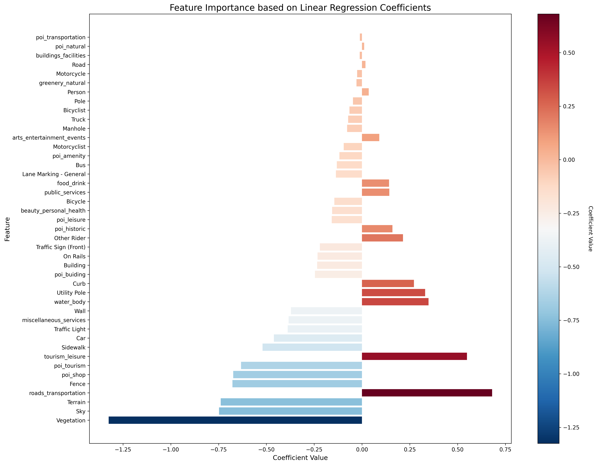

# Predicting Emotional Responses in Urban Environments: A Relational Graph Convolutional Variational Autoencoder Model

## Introduction

This thesis presents a novel approach to modeling physiological responses to urban environments using a Variational Autoencoder (VAE) with a Graph Convolutional Network (GCN) and a Regression Network. The study aims to address the gap in understanding real-time, real-world dynamics between spatial environments, temporal patterns, and human emotions.

## Methodology

### Data Collection and Preprocessing

- Data collected using Empatica E4 wristband and X-ing mobile application
- Preprocessed into a multitrack tensor format with five tracks: emotions, locations, durations, activities, and modes

### Graph Construction

- Represents transportation patterns as a relational graph
- Three types of edges: track, onset, and next edges

### Model Architecture

- VAE with GCN-enhanced encoder and regression network
- Processes graph-structured data representing daily activity patterns
- Predicts physiological responses (heart rate) in urban environments

## Results and Discussion

### Model Comparison

The VAE with Regression Network (VRN) outperformed other approaches in heart rate prediction.

### Feature Importance

Urban infrastructure correlated with higher heart rates, while natural areas were associated with lower heart rates.

### Mean Heart Rate Predictions

The model generated predictions of mean heart rates across different locations in Copenhagen.

### Feature Intensity Analysis

The study examined how changes in feature intensities affect predicted mean heart rates.

### Physical Feature Importance Map

This map highlights the importance of physical features in predicting heart rates across Copenhagen.

## Conclusion

The thesis demonstrated the effectiveness of the proposed model in predicting physiological responses to urban environments. Key findings include:

1. The model outperformed alternatives in heart rate prediction.
2. Urban infrastructure correlated with higher heart rates, while natural areas were associated with lower heart rates.
3. Location-based heart rate predictions provided insights into the physiological impact of urban environments.
4. Feature intensity analysis enabled simulation of urban design changes on emotions.

## Future Directions

Future work could enhance the model by:

- Incorporating additional features (e.g., air quality, noise levels, socioeconomic indicators)
- Integrating context-specific data (time of day, weather conditions, seasonal variations)
- Conducting focused experimental studies for validation
- Investigating temporal patterns more directly
- Developing more sophisticated emotional state proxies beyond mean heart rate

These enhancements could transform the model into a robust tool for urban planners and policymakers, aiding in the creation of health-promoting environments.
